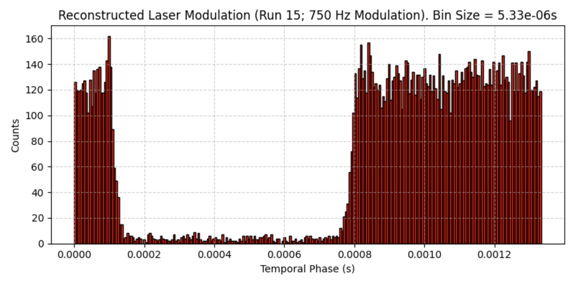

Here's the updated README with a Sources section:

**README.md**

# Photon Counting Lock-in Analysis Tools

This repository contains a collection of Python tools for analyzing photon counting data from PicoHarp TCSPC systems using various lock-in detection methods. These scripts process PTU files containing timestamp data to extract modulated signals and perform frequency-domain lifetime measurements.

## Overview

The tools implement different photon counting lock-in techniques:

- **Braun & Libchaber method** (`braun_lockin.py`) - Traditional lock-in detection using binning and reference signals
- **Liu method** (`liu_lockin.py`) - Reference-weighted counting with quadrature square-wave demodulation  
- **Jakob phase analysis** (`phase_hist_jakob.py`) - Dynamic period fitting for precise phase determination
- **Frequency-domain lifetime** (`FDLM_1.py`) - Single-exponential lifetime fitting from multi-frequency modulation data

## Files

- `braun_lockin.py` - Braun-style lock-in amplitude/phase extraction
- `FDLM_1.py` - Frequency-domain lifetime measurement pipeline
- `liu_lockin.py` - Liu quadrature lock-in with square-wave references
- `phase_hist_jakob.py` - Per-photon phase histogram analysis
- `reader.py` - Unified PTU file reader for PicoHarp 300/330 data
- `requirements.txt` - Python dependencies

## Requirements

```bash
pip install -r requirements.txt
```

## Basic Usage

### Braun Lock-in Analysis
```bash
python braun_lockin.py data.ptu --M 50 --trim-ends 1
```

### Frequency-Domain Lifetime
```bash
python FDLM_1.py /path/to/ptu_folder --marker-bit 1 --photon-channel 1 --N 10
```

### Liu Lock-in Detection  
```bash
python liu_lockin.py data.ptu --N 10 --duty 0.5 --bin-sec 1.0
```

### Phase Histogram
```bash
python phase_hist_jakob.py data.ptu --marker-bit 1 --bins 90
```

## Input Data

All tools expect PicoHarp `.ptu` files (T2 time-tagged time-resolved format) with:
- Channel 0: Reference/marker signals (modulation sync)
- Channel 1: Photon detection events

The PTU reader supports both PicoHarp 300 (legacy T2) and PicoHarp 330 (Generic T2) formats.

## Output

Each tool provides:
- Modulation depth (A) and phase (φ) measurements
- Statistical summaries (photon counts, reference edges)
- CSV export options for further analysis
- Visualization (phase histograms, lifetime fits)

## Demo Results

### Phase Histogram Analysis

*Example phase histogram showing photon distribution across modulation cycles. The clear sinusoidal pattern indicates strong modulation detection.*

### Frequency-Domain Lifetime Fit

*Single-exponential lifetime fit from phase data across multiple modulation frequencies. The curve shows the expected arctan(ωτ) relationship.*

### Lock-in Demodulation Output
```
File: modulated_signal.ptu
RESULT — Braun photon-counting lock-in:
  f_ref            : 1000.123456 Hz
  f_sample         : 50006.172800 Hz   (M = 50 bins/period)
  bins / photons   : 25000 / 75000
  I_dc (mean/bin)  : 3.000000 counts/bin
  A (mod depth)    : 0.15000000
  phi              : 0.785398163 rad  (45.000000 deg)
  bins_per_period  : 50
  trimmed periods  : 1 at start and end
```

### Liu Lock-in Time Tracking

*Time-resolved I and Q components from Liu lock-in analysis, showing stable demodulation over the measurement duration.*

## Sources

### Core Methods
- **Braun & Libchaber (2002)** - *"Trapping of DNA by dielectrophoretic cage in microfluidic arrays"* - Optics Letters 27, 1418 (2002)
- **Liu et al.** - Reference-weighted counting method for photon lock-in detection
- **Jakob phase analysis** - Dynamic linear fitting for robust period estimation against frequency drift

### Technical References
- **PicoHarp 300/330** - PicoQuant TCSPC system documentation and file formats
- **Frequency-domain lifetime** - Standard FD fluorescence lifetime measurement principles
- **Photon counting statistics** - Shot noise limits and signal processing in low-light conditions

### Implementation Notes
- PTU file format based on PicoQuant's "Read_PTU.py" reference implementation
- Some algorithms adapted from laboratory implementations and optimized for Python
- Error handling and edge cases tested with experimental data

## Notes

- Marker bits are zero-based (0-3) in all scripts
- The Jakob phase method provides robust period estimation against frequency drift
- Frequency-domain lifetime fitting supports both phase-only and joint amplitude-phase methods
- Liu lock-in works with adjustable duty cycle square waves

These tools were developed for analyzing modulated fluorescence signals in time-correlated single photon counting experiments.