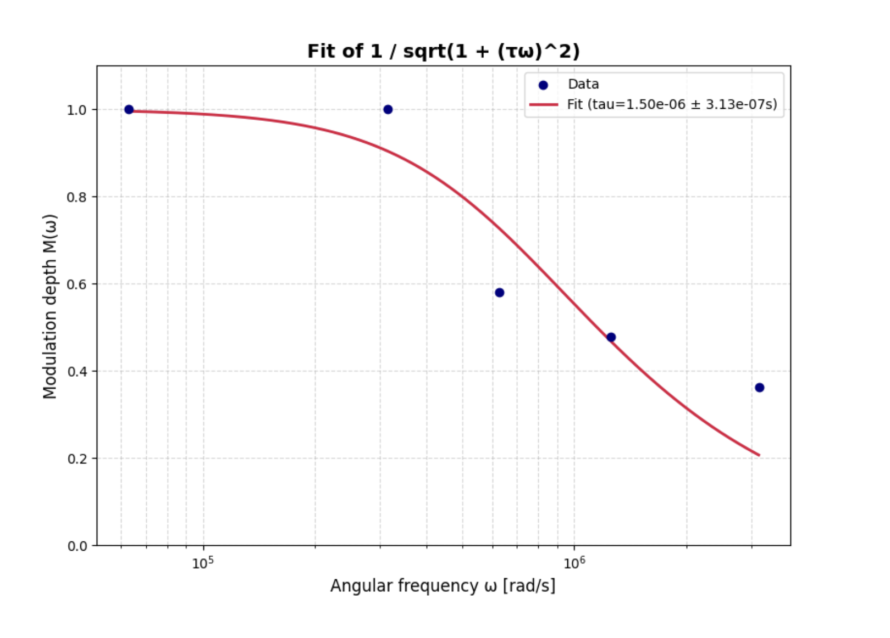
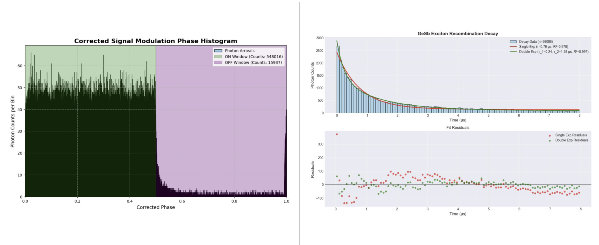
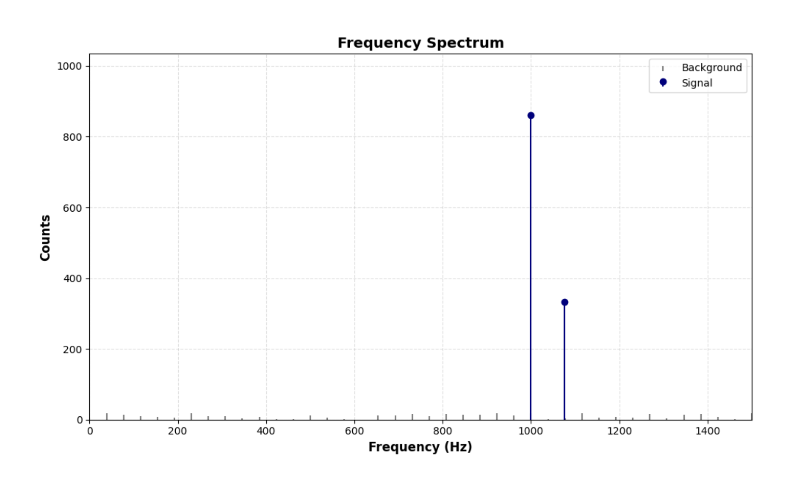
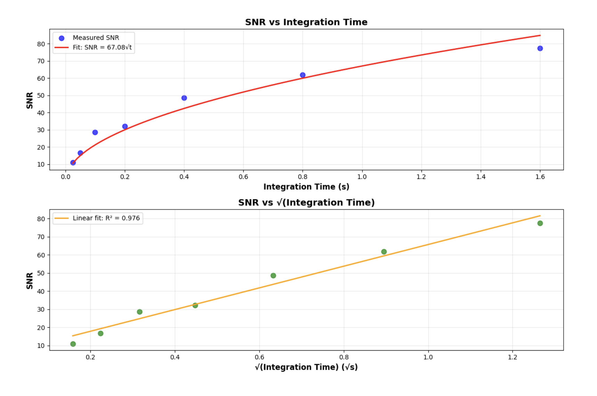
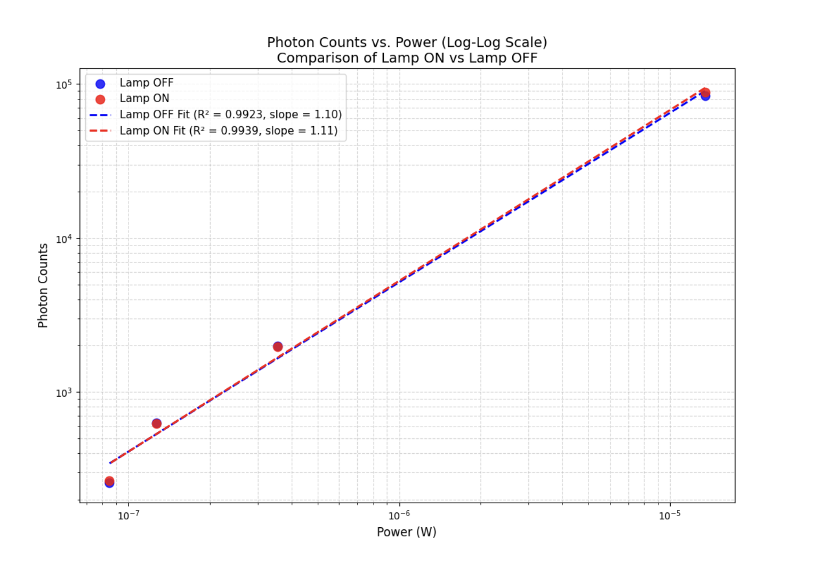
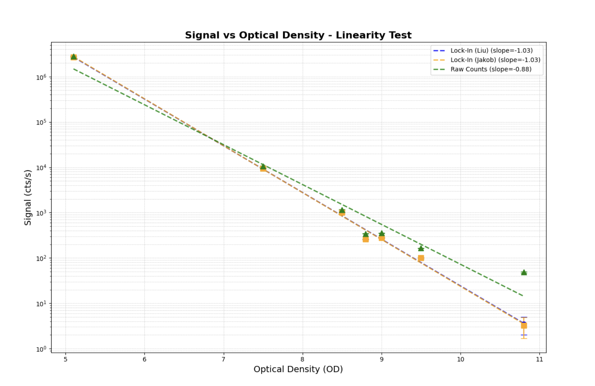

Here's the updated README with the new image structure:

**README.md**

# Photon Counting Lock-in Analysis Tools

This repository contains a collection of Python tools for analyzing photon counting data from PicoHarp TCSPC systems using various lock-in detection methods. These scripts process PTU files containing timestamp data to extract modulated signals and perform frequency-domain lifetime measurements.

## Overview

The tools implement different photon counting lock-in techniques:

- **Braun & Libchaber method** (`braun_lockin.py`) - Traditional lock-in detection using binning and reference signals
- **Liu method** (`liu_lockin.py`) - Reference-weighted counting with quadrature square-wave demodulation  
- **Jakob phase analysis** (`phase_hist_jakob.py`) - Dynamic period fitting for precise phase determination
- **Frequency-domain lifetime** (`FDLM_1.py`) - Single-exponential lifetime fitting from multi-frequency modulation data

## Files

- `braun_lockin.py` - Braun-style lock-in amplitude/phase extraction
- `FDLM_1.py` - Frequency-domain lifetime measurement pipeline
- `liu_lockin.py` - Liu quadrature lock-in with square-wave references
- `phase_hist_jakob.py` - Per-photon phase histogram analysis
- `reader.py` - Unified PTU file reader for PicoHarp 300/330 data
- `requirements.txt` - Python dependencies

## Requirements

```bash
pip install -r requirements.txt
```

## Basic Usage

### Braun Lock-in Analysis
```bash
python braun_lockin.py data.ptu --M 50 --trim-ends 1
```

### Frequency-Domain Lifetime
```bash
python FDLM_1.py /path/to/ptu_folder --marker-bit 1 --photon-channel 1 --N 10
```

### Liu Lock-in Detection  
```bash
python liu_lockin.py data.ptu --N 10 --duty 0.5 --bin-sec 1.0
```

### Phase Histogram
```bash
python phase_hist_jakob.py data.ptu --marker-bit 1 --bins 90
```

## Input Data

All tools expect PicoHarp `.ptu` files (T2 time-tagged time-resolved format) with:
- Channel 0: Reference/marker signals (modulation sync)
- Channel 1: Photon detection events

The PTU reader supports both PicoHarp 300 (legacy T2) and PicoHarp 330 (Generic T2) formats.

## Output

Each tool provides:
- Modulation depth (A) and phase (φ) measurements
- Statistical summaries (photon counts, reference edges)
- CSV export options for further analysis
- Visualization (phase histograms, lifetime fits)

## Demo Results

### Frequency-Domain Lifetime Analysis

*Frequency-domain lifetime measurement showing phase vs modulation frequency. The curve fit demonstrates single-exponential decay behavior with τ =  1.5 μs.*

### Lifetime from Phase Histogram

*Fluorescence lifetime extraction from phase histogram data. The modulation depth and phase shift provide complementary lifetime information.*

### Demultiplexing Capabilities

*Signal demultiplexing performance showing separation of multiple modulated sources using phase-sensitive detection.*

### Shot Noise Limited Performance

*System performance reaching the theoretical shot noise limit, demonstrating optimal signal-to-noise ratio for photon counting applications.*

### Noise Rejection

*Excellent noise rejection capabilities showing clean signal recovery even in low signal-to-noise conditions.*

### System Linearity

*Linear response of the lock-in system across different signal intensities, confirming quantitative measurement capability.*

### Phase Histogram Analysis

*High-resolution phase histogram showing photon distribution across modulation cycles with clear sinusoidal modulation pattern.*

## Sources

### Core Methods
- **Braun, Dieter & Libchaber, Albert.** (2002). Computer-based photon-counting lock-in for phase detection at the shot-noise limit. Optics Letters. 27. 1418-1420. 10.1364/OL.27.001418. 
- **D. Liu et al.** "Toward Quantitative Near Infrared Brain Functional Imaging: Lock-In Photon Counting Instrumentation Combined With Tomographic Reconstruction," in IEEE Access, vol. 7, pp. 86829-86842, 2019, doi: 10.1109/ACCESS.2019.2924710.
keywords: {Photonics;Instruments;Frequency modulation;Optical imaging;Optical sensors;Functional near-infrared spectroscopic imaging;diffuse optical tomography;square-wave modulation;lock-in photon-counting},
- **Chen W, Wang X, Wang B, Wang Y, Zhang Y, Zhao H, Gao F.** Lock-in-photon-counting-based highly-sensitive and large-dynamic imaging system for continuous-wave diffuse optical tomography. Biomed Opt Express. 2016 Jan 15;7(2):499-511. doi: 10.1364/BOE.7.000499. PMID: 26977358; PMCID: PMC4771467.
- **L. Jakob, W. Deacon, O. Hicks, I. Manyakin, O. Ojambati, M. Traxler, and J. Baumberg** "Single photon multiclock lock-in detection by picosecond timestamping," Optica  8, 1646-1653 (2021).

### Technical References
- **PicoHarp 300/330** - PicoQuant TCSPC system documentation and file formats
- (2006). Frequency-Domain Lifetime Measurements. In: Lakowicz, J.R. (eds) Principles of Fluorescence Spectroscopy. Springer, Boston, MA. https://doi.org/10.1007/978-0-387-46312-4_5

### Implementation Notes
- PTU file format based on PicoQuant's "Read_PTU.py" reference implementation
- Error handling and edge cases tested with experimental data

## Notes
- Marker bits are zero-based (0-3) in all scripts
- The Jakob phase method provides robust period estimation against frequency drift
- Frequency-domain lifetime fitting supports both phase-only and joint amplitude-phase methods
- Liu lock-in works with adjustable duty cycle square waves

These tools were developed for analyzing modulated fluorescence signals in time-correlated single photon counting experiments.

---